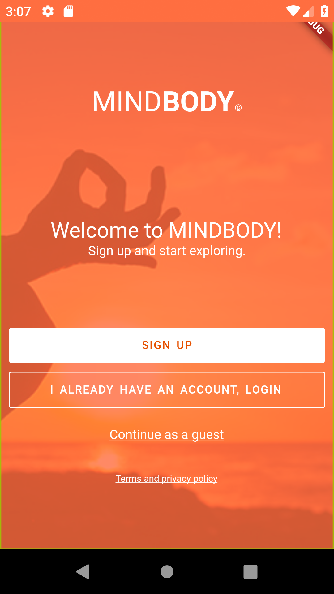
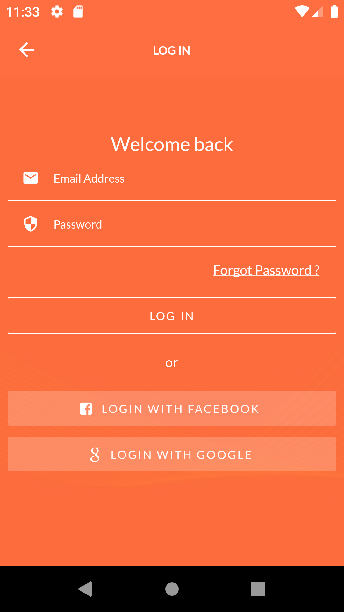

# Sign in UI for MindBlown

A UI Flutter project that shows a sign up page. This was done as a coding challenge of [Weekly Coding Challenge](https://www.florin-pop.com/blog/2019/03/double-slider-sign-in-up-form/)

My main aim is to learn Flutter using these challenge.

UI inspiration was from [Miles Cartwright](https://dribbble.com/mcartw20) Dribble [Login UI](https://dribbble.com/shots/6478687-MINDBODY-app-login)

## Installing process

### Prerequisite

- Have Flutter install. You can learn how to install Flutter in [here](https://flutter.dev/docs/get-started/install)

### Steps

- Clone or download the project
- Open terminal
- Get into the project folder
- Run **flutter packages get**
- Then open project in your emulator/phone with **flutter run**

## Things learnt from the project

This project has taught me a couple of things and concepts.

- Making of UI Layout.
  - Creating a background Image using Stack Widget.
  - Using Filters on Images.
  - Using TextFields
  - Making app theme using ThemeData
  - Using custom icons.
- Navigation.
  - Able to navigate to a new page using a named route.
- Testing.
  - Tested that the login button does navigate to login page
  - Finding Widgets and using Matchers.

## Problems faced

I did get some problems.

- Font not changing. The Lato seem to not be working. Have no idea of why?

## Future Development

I am hoping to develop the app further.

- Add Authentication functionality.

  - User Should be able to sign in with Google / Facebook / Email and Password
  - Add Validation.
  - Add State management
  - Add Sign Up Page.
